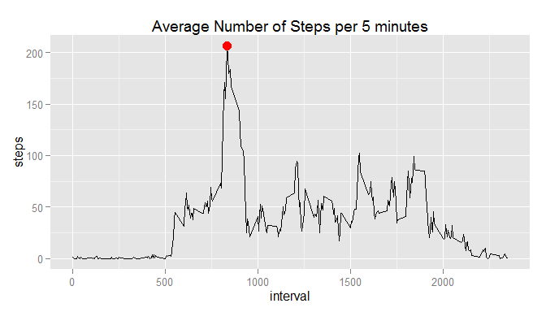
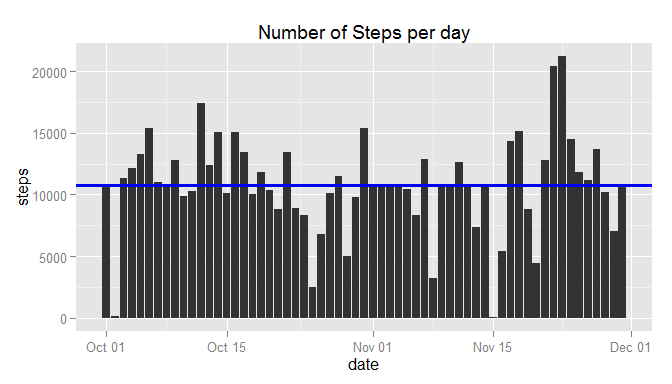
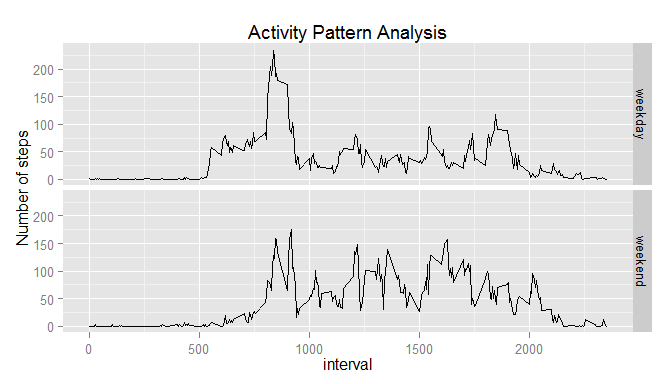

# Reproducible Research: Peer Assessment 1


In this report we will analyze data collected by a personal activity monitoring device. The data consists of two months of data from an anonymous individual collected during the months of October and November, 2012 and include the number of steps taken in 5 minute intervals each day.

## Loading and preprocessing the data
The dataset to be analyzed is stored in the archive activity.zip. and includes 17,568 obvervations with the following variables:

- steps: Number of steps taking in a 5-minute interval (missing values are coded as NA)
- date: The date on which the measurement was taken in YYYY-MM-DD format
- interval: Identifier for the 5-minute interval in which measurement was taken

In this study we will basically analyze data without NA.  


```r
if(!file.exists("activity.zip")){
        stop("activity.zip file not present")
}
unzip("activity.zip")
All_Steps <- read.csv("activity.csv", colClasses = c("integer", "Date", "integer"))
OK_Steps <- na.omit(All_Steps)
```

As an example the first rows of the cleaned data frame (with no NA) are as follows:


```r
OK_Steps[1:5,]
```

```
##     steps       date interval
## 289     0 2012-10-02        0
## 290     0 2012-10-02        5
## 291     0 2012-10-02       10
## 292     0 2012-10-02       15
## 293     0 2012-10-02       20
```


## What is mean total number of steps taken per day?

Using the OK_Steps that is not including NA values, the number of steps per day over the two months observation are showed in the following picture


```r
Day_Steps <- with(OK_Steps,aggregate(steps, by = list(date), sum))
names(Day_Steps) <- c("date", "steps")
Mean_Steps <- as.integer(mean(Day_Steps$step))
Median_Steps <- as.integer(median(Day_Steps$step))

library(ggplot2)
g <- ggplot(Day_Steps, aes(date,steps)) + geom_bar(stat="identity")
g <- g + labs(title="Number of Steps per day")
g <- g + geom_hline(yintercept = c(Mean_Steps,Median_Steps), color = "blue", size = 1)
plot(g)
```

 

The picture is also showing in blue the median = 10765 and mean = 10766 number of steps per day over the two months observation period. 


## What is the average daily activity pattern?
Let's evaluate the daily activity pattern averaged over all the days


```r
Pat_Steps <- with(OK_Steps,aggregate(steps, by=list(interval), FUN="mean"))
names(Pat_Steps) <- c("interval", "steps")
iMax_Step <- which.max(Pat_Steps$steps)
Max_Step <- Pat_Steps[iMax_Step,]

g <- ggplot(Pat_Steps, aes(interval,steps)) + geom_line()
g <- g + labs(title = "Average Number of Steps per 5 minutes")
g <- g + geom_point(data=Max_Step, aes(interval,steps), color = "red", size = 4)
plot(g)
```

 
 

The maximum number of steps made in 5 minutes period, on average across all observation period, is equal to 206.1698113 and it is the interval number 835, corresponding to the red point in the previous figure.


## Imputing missing values
Now let's evalute the impact of missing values on previously calculated mean and median per day.


```r
Mean_Step_5 <- as.integer(mean(OK_Steps$steps))
iNA_Steps <- (is.na(All_Steps$steps))
NA_Steps <- sum(iNA_Steps)
Full_Steps <- All_Steps
Full_Steps[iNA_Steps,"steps"] <- Mean_Step_5

Full_Day_Steps <- with(Full_Steps,aggregate(steps, by = list(date), sum))
names(Full_Day_Steps) <- c("date", "steps")
Full_Mean_Steps <- as.integer(mean(Full_Day_Steps$step))
Full_Median_Steps <- as.integer(median(Full_Day_Steps$step))

g <- ggplot(Full_Day_Steps, aes(date,steps)) + geom_bar(stat="identity")
g <- g + labs(title="Number of Steps per day")
g <- g + geom_hline(yintercept = c(Full_Mean_Steps,Full_Median_Steps), color = "blue", size = 1)
plot(g)
```

 

The number of NA value in the unnprocessed data set, is equal to 2304.
In order to evaluate the impact of NA on calculated data, we will substitute NA with the previously calulated Mean_Step_5, equal to 37. 

The mean and median steps per day calculated with imputed missing values, are equal to 10751 and 10656 respectively, that are different from previously calcualted mean and median values.

THe impact of the imputed missing values is to decrease both mean value from 10766 to 10751 and median value from 10765 to 10656.


## Are there differences in activity patterns between weekdays and weekends?
Let's analyze the patterns splitting number of steps made during weekdays and during weekends.
We will be using the original data without missing values.


```r
Week_Steps <- OK_Steps
iwday <- weekdays(OK_Steps[,"date"]) %in% c("Monday", "Tuesday", "Wednesday", 
                                              "Thursday", "Friday")
Week_Steps[iwday,"Daytype"] <- "weekday"
Week_Steps[!iwday,"Daytype"] <- "weekend"
Week_Steps$Daytype <- as.factor(Week_Steps$Daytype)

Pat_WSteps <- with(Week_Steps,aggregate(steps, by=list(interval,Daytype), FUN="mean"))
names(Pat_WSteps) <- c("interval", "Daytype", "steps")


g <- ggplot(Pat_WSteps, aes(interval,steps)) + geom_line() + facet_grid(Daytype ~ .)
g <- g + labs(title = "Activity Pattern Analysis", y = "Number of steps")
print(g)
```

 

The activity pattern recorded during weekday is different from the one recording during weekend.


