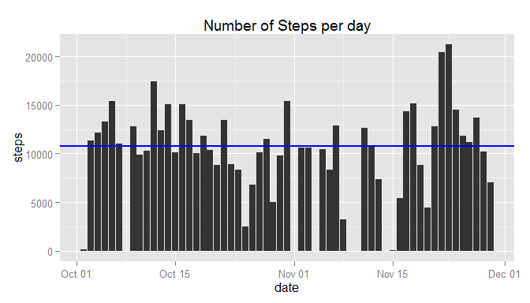

# Reproducible Research: Peer Assessment 1


## Loading and preprocessing the data
The data to be analyzed is included in the archive activity.zip.The full data set is loaded and a copy of it is created without the missing values = NA. Both datasets, with and without missing values, are needed to answer the following questions.


```r
if(!file.exists("activity.zip")){
        stop("activity.zip file not present")
}
unzip("activity.zip")
All_Steps <- read.csv("activity.csv", colClasses = c("integer", "Date", "integer"))
OK_Steps <- na.omit(All_Steps)
```

As an example the first rows of the cleaned data frame are as follows:


```r
OK_Steps[1:5,]
```

```
##     steps       date interval
## 289     0 2012-10-02        0
## 290     0 2012-10-02        5
## 291     0 2012-10-02       10
## 292     0 2012-10-02       15
## 293     0 2012-10-02       20
```


## What is mean total number of steps taken per day?

Using the OK_Steps that is not including NA values, the number of steps per day over the two months observation are showed in the following picture


```r
Day_Steps <- with(OK_Steps,aggregate(steps, by = list(date), sum))
names(Day_Steps) <- c("date", "steps")
Mean_Steps <- as.integer(mean(Day_Steps$step))
Median_Steps <- as.integer(median(Day_Steps$step))

library(ggplot2)
g <- ggplot(Day_Steps, aes(date,steps)) + geom_bar(stat="identity")
g <- g + labs(title="Steps per day")
g <- g + geom_hline(yintercept = c(Mean_Steps,Median_Steps))
plot(g)
```

 

The picture is also showing the median 10765 and mean 10766 number of steps per day over the two months observation period. 


## What is the average daily activity pattern?


## Imputing missing values


## Are there differences in activity patterns between weekdays and weekends?
